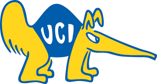

# MAE 285: Uncertainty Design

  
  

This repository is an implementation of a Graph Neural Network for the course 285 from the Mechanical and Arospace Department of the University of California Irvine.
In this porject, we implemented a [Learning Mesh-Based Simulation with Graph Networks](https://arxiv.org/abs/2010.03409) for computing torsion and deformation over
distinct beams profiles.

